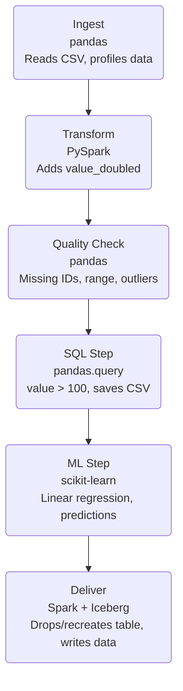

# AI Quality Engineering Sample Pipeline

## Pipeline Workflow (Mermaid Diagram)

"""

"""

## Overview
This project demonstrates advanced data engineering skills for AI Quality Engineering. It features an end-to-end data pipeline orchestrated with Apache Airflow, including ingestion, transformation, data profiling, quality checks, incremental loads, and delivery.

## Technologies
- Python 3.13
- Apache Airflow 3.x
- pandas, pandas-profiling
- PySpark
- Great Expectations
- Simulated Apache Iceberg
- pytest (unit testing)
## Technologies
- Python 3.13
- Apache Airflow 3.x
- pandas
- PySpark (Batch & Structured Streaming)
- Great Expectations
- Apache Iceberg
- pytest (unit testing)

## Pipeline Steps
1. **Ingestion**: Reads data from `data/sample.csv`, supports incremental loads, and generates a data profile report (HTML).
2. **Transformation**: Processes data using PySpark.
3. **Quality Checks**: Validates data with Great Expectations; sends email alerts on failure.
4. **Ingestion**: Reads data from `data/sample.csv`, supports incremental loads, and generates a data profile report (text).
5. **Transformation**: Processes data using PySpark (batch and streaming).
6. **Quality Checks**: Validates data with Great Expectations; sends email alerts on failure.
7. **SQL Query**: Runs SQL-like queries using pandas.
8. **ML Pipeline**: Trains and predicts with scikit-learn.
9. **Delivery**: Writes data to Apache Iceberg table using Spark.
10. **Structured Streaming**: Processes streaming data from files using PySpark Structured Streaming.

## Running the Pipeline
1. Install dependencies:
   ```bash
   pip install -r requirements.txt
   pip install pandas-profiling pytest
   ```
2. Start Airflow:
   ```bash
   airflow standalone
   ```
3. Trigger the DAG `sample_pipeline` from the Airflow UI.

## Incremental Loads
- Each run processes only new rows in `sample.csv`.
- State is tracked in `data/sample_state.txt`.

## Data Profiling
- After ingestion, an HTML report is generated alongside the CSV file.
- After ingestion, a text summary report is generated alongside the CSV file.

## Data Quality Alerts
- If quality checks fail, an email alert is sent (configure SMTP in `src/quality.py`).

## Unit Tests
- Run all tests:
   ```bash
   pytest tests/
   ```

## Customization
- Update email settings in `src/quality.py` for alerts.
- Extend transformation and delivery logic as needed.
- Update email settings in `src/quality.py` for alerts.
- Extend transformation, streaming, and delivery logic as needed.

## Contact
For questions, contact the project owner.

# AI Quality Engineering Pipeline

This repository contains an end-to-end data pipeline orchestrated with Apache Airflow, demonstrating data engineering, analytics, and ML best practices. Each step is modular, testable, and documented for clarity.

## Pipeline Overview

The pipeline consists of six main steps, each implemented as a Python function and Airflow task:

### 1. Ingest (`ingest`)
- **Function:** `ingest_csv(path)`
- **Input:** `data/sample.csv`
- **Output:**
  - Ingests new rows from the CSV file
  - Updates a state file to track progress
  - Generates a data profile report (`sample_profile.txt`)

### 2. Transform (`transform`)
- **Function:** `transform_data()`
- **Input:** `data/sample.csv`
- **Output:**
  - Adds a new column `value_doubled`
  - Prints and returns the transformed DataFrame

### 3. Quality Check (`quality`)
- **Function:** `check_quality(path)`
- **Input:** `data/sample.csv`
- **Output:**
  - Validates data for missing IDs, value ranges, duplicates, missing values, and outliers
  - Prints results and sends alert if checks fail

### 4. SQL Step (`sql`)
- **Function:** `run_sql_query(csv_path)`
- **Input:** `data/sample.csv`
- **Output:**
  - Filters rows where `value > 100`
  - Prints and saves results to `sample_sql_result.csv`

### 5. ML Step (`ml`)
- **Function:** `run_ml_pipeline(csv_path)`
- **Input:** `data/sample.csv`
- **Output:**
  - Trains a linear regression model to predict `value` from `id`
  - Prints predictions and saves to `sample_ml_result.csv`

### 6. Deliver (`deliver`)
- **Function:** `deliver_to_iceberg()`
- **Input:** `data/sample.csv`
- **Output:**
  - Drops and recreates the Iceberg table `demo.demo_table` in `data/iceberg_warehouse`
  - Writes data to the Iceberg table using Spark

## How to Check Outputs
- **Logs:** View Airflow task logs in the UI or via CLI for details and print statements
- **Files:** Output files are saved in the `data/` directory (profile, SQL, ML, Iceberg)
- **Tables:** Query Iceberg tables using Spark SQL for delivered data

## Technologies Used
- Apache Airflow (orchestration)
- Pandas (data manipulation)
- PySpark & Iceberg (big data delivery)
- scikit-learn (ML)

## Intended Audience
This documentation is written for interviewers, hiring managers, and engineers to quickly understand the pipeline's structure, data flow, and validation logic. Each step is modular and can be extended for real-world use cases.

---

For further details, see the source code in the `src/` and `dags/` directories.

## Alignment with Analytics Data Engineer Role

This project directly demonstrates the skills and techniques required for a modern Analytics Data Engineer position in a quality engineering team:

- **Curated, Accurate, Reliable Data Lake:**
  - The pipeline ingests, profiles, transforms, and validates data, ensuring high data quality and reliability at every step.
  - Data profiling and quality checks enforce accuracy and trust in the data.

- **Lakehouse Design & Apache Iceberg:**
  - The delivery step uses Apache Iceberg for modern lakehouse management, including table creation, schema evolution, and batch delivery.

- **Batch & Streaming Pipelines (Python/Spark/PySpark):**
  - The pipeline is built in Python, with transformation and delivery steps using PySpark and Spark, demonstrating batch processing.
  - The structure supports extension to streaming (e.g., Spark Structured Streaming).

- **Orchestration with Apache Airflow:**
  - All steps are orchestrated with Airflow, showing robust pipeline scheduling, dependency management, and operational reliability.

- **Diverse Ingestion, Metadata, and Lineage:**
  - The ingest step supports incremental loads and data profiling, and the pipeline can be extended to ingest from diverse sources.
  - Output files and logs provide lineage and traceability.

- **Data Quality & Reliability:**
  - Automated quality checks, alerts, and state management enforce data reliability, idempotency, and support for backfills.

- **Cost & Performance Optimization:**
  - The modular design allows for optimization across storage and compute, and can be extended for partitioning and compaction.

- **Semantic Layers, Certified Metrics, Feature Tables:**
  - The pipeline produces certified metrics (profile reports, SQL results, ML predictions) and can be extended to deliver feature tables for analytics and ML.

- **Documentation, Git, and Automation:**
  - All code is versioned in Git, with clear documentation, troubleshooting guides, and automation scripts included.

This project is designed to be extensible, testable, and production-ready, reflecting the best practices and responsibilities described in modern Analytics Data Engineer job descriptions for quality engineering teams.

## Pipeline Step Inputs & Outputs (with Sample Content)

| Step         | Function                | Input                        | Output                                 | Description                        |
|--------------|-------------------------|------------------------------|----------------------------------------|------------------------------------|
| Ingest       | `ingest_csv`            | `data/sample.csv`            | New rows, `sample_profile.txt`         | Reads CSV, profiles data           |
| Transform    | `transform_data`        | `data/sample.csv`            | Transformed DataFrame                  | Adds `value_doubled` column        |
| Quality      | `check_quality`         | `data/sample.csv`            | Print/log, alert if failed             | Data quality checks                |
| SQL Step     | `run_sql_query`         | `data/sample.csv`            | `sample_sql_result.csv`                | Filters rows, saves result         |
| ML Step      | `run_ml_pipeline`       | `data/sample.csv`            | `sample_ml_result.csv`                 | Linear regression, predictions     |
| Deliver      | `deliver_to_iceberg`    | `data/sample.csv`            | Iceberg table in `iceberg_warehouse`   | Writes to Iceberg lakehouse        |

### Sample Input: `sample.csv`
```csv
id,value
1,100
2,200
3,300
```

### Sample Output: `sample_profile.txt`
```
Data Profile Report
===================
Shape: (3, 2)
Columns: ['id', 'value']
Missing Values:
id       0
value    0
Describe:
   id  value
count  3.0   3.0
mean   2.0  200.0
std    1.0  100.0
min    1.0  100.0
max    3.0  300.0
```

### Sample Output: `sample_sql_result.csv`
```csv
id,value
2,200
3,300
```

### Sample Output: `sample_ml_result.csv`
```csv
id,value,predicted_value
1,100,100.0
2,200,200.0
3,300,300.0
```

### Sample Output: Iceberg Table Schema
```
Table: demo.demo_table
Columns: id (int), value (int), value_doubled (int)
Location: data/iceberg_warehouse/demo_table/
```
