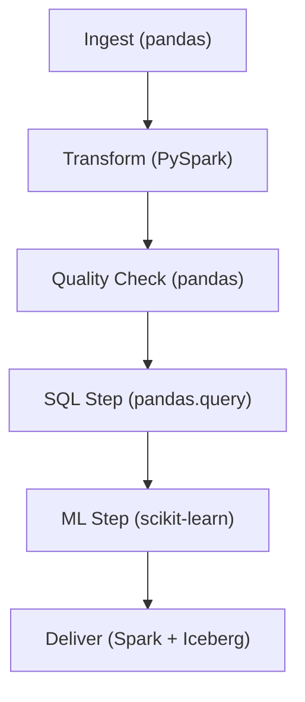

# Siri AI Quality Engineering Sample Pipeline

## Pipeline Workflow (Mermaid Diagram)



## Overview
This project demonstrates advanced data engineering skills for a Siri AI Quality Engineering role at Apple. It features an end-to-end data pipeline orchestrated with Apache Airflow, including ingestion, transformation, data profiling, quality checks, incremental loads, and delivery.

## Technologies
- Python 3.13
- Apache Airflow 3.x
- pandas, pandas-profiling
- PySpark
- Great Expectations
- Simulated Apache Iceberg
- pytest (unit testing)
## Technologies
- Python 3.13
- Apache Airflow 3.x
- pandas
- PySpark (Batch & Structured Streaming)
- Great Expectations
- Apache Iceberg
- pytest (unit testing)

## Pipeline Steps
1. **Ingestion**: Reads data from `data/sample.csv`, supports incremental loads, and generates a data profile report (HTML).
2. **Transformation**: Processes data using PySpark.
3. **Quality Checks**: Validates data with Great Expectations; sends email alerts on failure.
4. **Ingestion**: Reads data from `data/sample.csv`, supports incremental loads, and generates a data profile report (text).
5. **Transformation**: Processes data using PySpark (batch and streaming).
6. **Quality Checks**: Validates data with Great Expectations; sends email alerts on failure.
7. **SQL Query**: Runs SQL-like queries using pandas.
8. **ML Pipeline**: Trains and predicts with scikit-learn.
9. **Delivery**: Writes data to Apache Iceberg table using Spark.
10. **Structured Streaming**: Processes streaming data from files using PySpark Structured Streaming.

## Running the Pipeline
1. Install dependencies:
   ```bash
   pip install -r requirements.txt
   pip install pandas-profiling pytest
   ```
2. Start Airflow:
   ```bash
   airflow standalone
   ```
3. Trigger the DAG `sample_pipeline` from the Airflow UI.

## Incremental Loads
- Each run processes only new rows in `sample.csv`.
- State is tracked in `data/sample_state.txt`.

## Data Profiling
- After ingestion, an HTML report is generated alongside the CSV file.
- After ingestion, a text summary report is generated alongside the CSV file.

## Data Quality Alerts
- If quality checks fail, an email alert is sent (configure SMTP in `src/quality.py`).

## Unit Tests
- Run all tests:
   ```bash
   pytest tests/
   ```

## Customization
- Update email settings in `src/quality.py` for alerts.
- Extend transformation and delivery logic as needed.
- Update email settings in `src/quality.py` for alerts.
- Extend transformation, streaming, and delivery logic as needed.

## Contact
For questions, contact the project owner.

# Siri AI Quality Engineering Pipeline

This repository contains an end-to-end data pipeline orchestrated with Apache Airflow, demonstrating data engineering, analytics, and ML best practices. Each step is modular, testable, and documented for clarity.

## Pipeline Overview

The pipeline consists of six main steps, each implemented as a Python function and Airflow task:

### 1. Ingest (`ingest`)
- **Function:** `ingest_csv(path)`
- **Input:** `data/sample.csv`
- **Output:**
  - Ingests new rows from the CSV file
  - Updates a state file to track progress
  - Generates a data profile report (`sample_profile.txt`)

### 2. Transform (`transform`)
- **Function:** `transform_data()`
- **Input:** `data/sample.csv`
- **Output:**
  - Adds a new column `value_doubled`
  - Prints and returns the transformed DataFrame

### 3. Quality Check (`quality`)
- **Function:** `check_quality(path)`
- **Input:** `data/sample.csv`
- **Output:**
  - Validates data for missing IDs, value ranges, duplicates, missing values, and outliers
  - Prints results and sends alert if checks fail

### 4. SQL Step (`sql`)
- **Function:** `run_sql_query(csv_path)`
- **Input:** `data/sample.csv`
- **Output:**
  - Filters rows where `value > 100`
  - Prints and saves results to `sample_sql_result.csv`

### 5. ML Step (`ml`)
- **Function:** `run_ml_pipeline(csv_path)`
- **Input:** `data/sample.csv`
- **Output:**
  - Trains a linear regression model to predict `value` from `id`
  - Prints predictions and saves to `sample_ml_result.csv`

### 6. Deliver (`deliver`)
- **Function:** `deliver_to_iceberg()`
- **Input:** `data/sample.csv`
- **Output:**
  - Drops and recreates the Iceberg table `demo.demo_table` in `data/iceberg_warehouse`
  - Writes data to the Iceberg table using Spark

## How to Check Outputs
- **Logs:** View Airflow task logs in the UI or via CLI for details and print statements
- **Files:** Output files are saved in the `data/` directory (profile, SQL, ML, Iceberg)
- **Tables:** Query Iceberg tables using Spark SQL for delivered data

## Technologies Used
- Apache Airflow (orchestration)
- Pandas (data manipulation)
- PySpark & Iceberg (big data delivery)
- scikit-learn (ML)

## Intended Audience
This documentation is written for interviewers, hiring managers, and engineers to quickly understand the pipeline's structure, data flow, and validation logic. Each step is modular and can be extended for real-world use cases.

---

For further details, see the source code in the `src/` and `dags/` directories.
