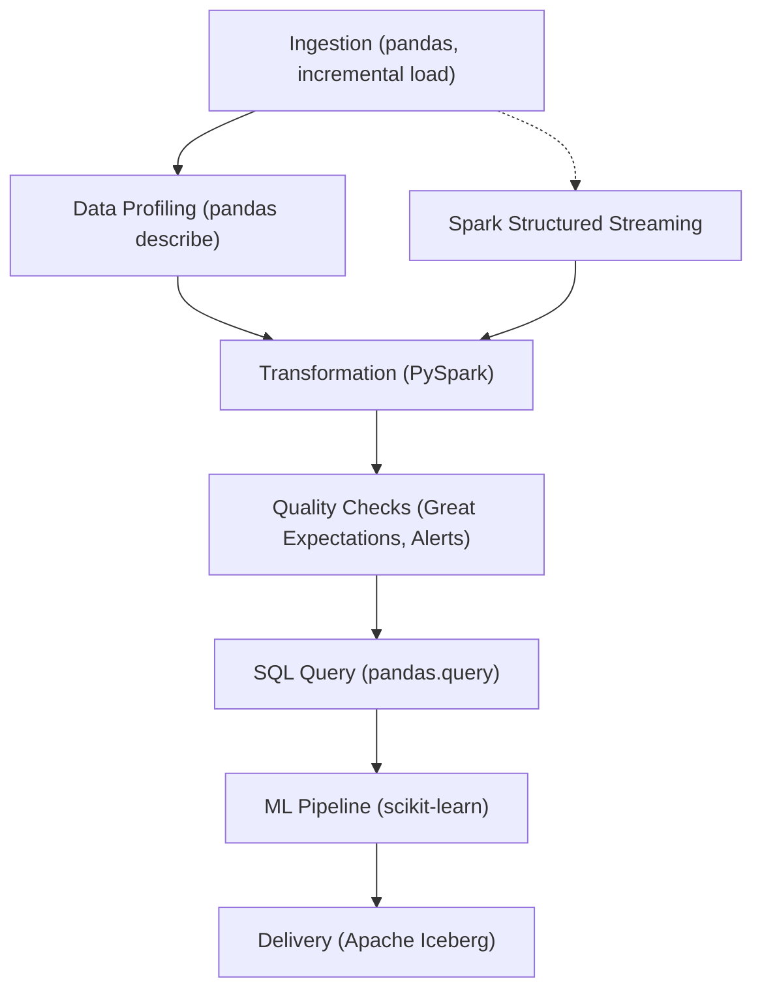

# Siri AI Quality Engineering Sample Pipeline

## Pipeline Workflow (Mermaid Diagram)



## Overview
This project demonstrates advanced data engineering skills for a Siri AI Quality Engineering role at Apple. It features an end-to-end data pipeline orchestrated with Apache Airflow, including ingestion, transformation, data profiling, quality checks, incremental loads, and delivery.

## Technologies
- Python 3.13
- Apache Airflow 3.x
- pandas, pandas-profiling
- PySpark
- Great Expectations
- Simulated Apache Iceberg
- pytest (unit testing)
## Technologies
- Python 3.13
- Apache Airflow 3.x
- pandas
- PySpark (Batch & Structured Streaming)
- Great Expectations
- Apache Iceberg
- pytest (unit testing)

## Pipeline Steps
1. **Ingestion**: Reads data from `data/sample.csv`, supports incremental loads, and generates a data profile report (HTML).
2. **Transformation**: Processes data using PySpark.
3. **Quality Checks**: Validates data with Great Expectations; sends email alerts on failure.
4. **Ingestion**: Reads data from `data/sample.csv`, supports incremental loads, and generates a data profile report (text).
5. **Transformation**: Processes data using PySpark (batch and streaming).
6. **Quality Checks**: Validates data with Great Expectations; sends email alerts on failure.
7. **SQL Query**: Runs SQL-like queries using pandas.
8. **ML Pipeline**: Trains and predicts with scikit-learn.
9. **Delivery**: Writes data to Apache Iceberg table using Spark.
10. **Structured Streaming**: Processes streaming data from files using PySpark Structured Streaming.

## Running the Pipeline
1. Install dependencies:
   ```bash
   pip install -r requirements.txt
   pip install pandas-profiling pytest
   ```
2. Start Airflow:
   ```bash
   airflow standalone
   ```
3. Trigger the DAG `sample_pipeline` from the Airflow UI.

## Incremental Loads
- Each run processes only new rows in `sample.csv`.
- State is tracked in `data/sample_state.txt`.

## Data Profiling
- After ingestion, an HTML report is generated alongside the CSV file.
- After ingestion, a text summary report is generated alongside the CSV file.

## Data Quality Alerts
- If quality checks fail, an email alert is sent (configure SMTP in `src/quality.py`).

## Unit Tests
- Run all tests:
   ```bash
   pytest tests/
   ```

## Customization
- Update email settings in `src/quality.py` for alerts.
- Extend transformation and delivery logic as needed.
- Update email settings in `src/quality.py` for alerts.
- Extend transformation, streaming, and delivery logic as needed.

## Contact
For questions, contact the project owner.
